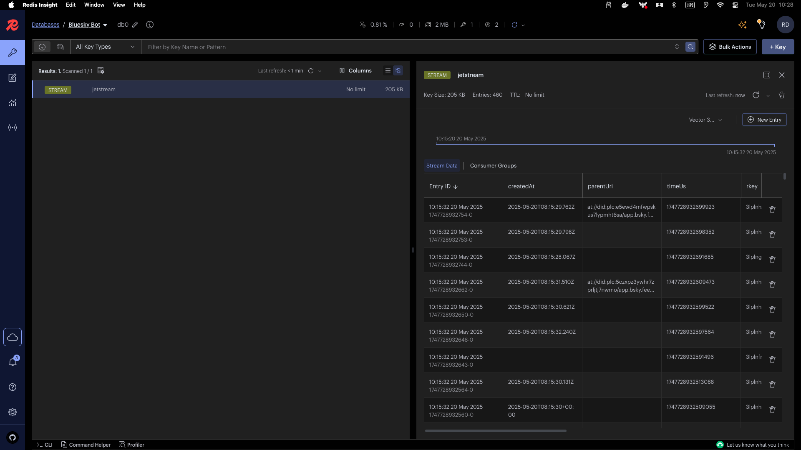
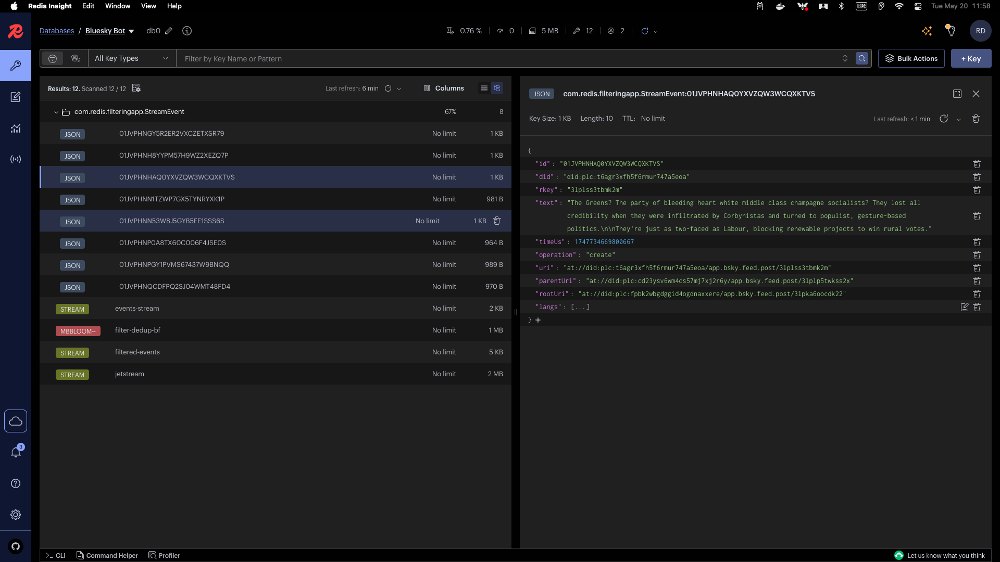
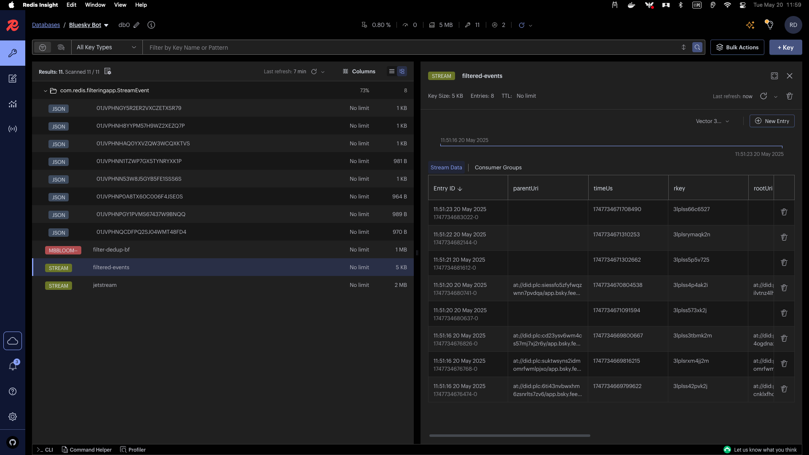
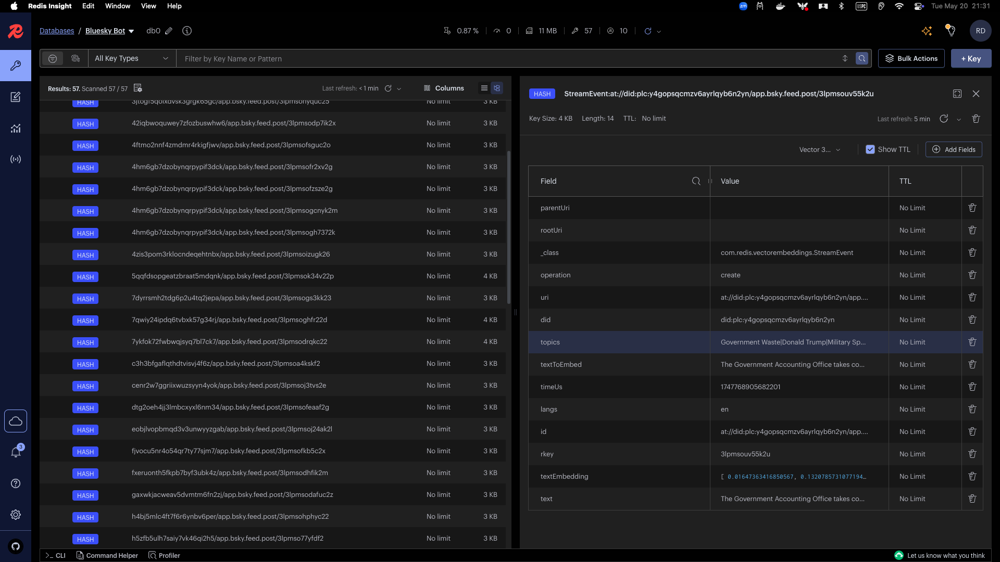

# Building a Bluesky Bot with Java and Redis

## Introduction

Welcome to this workshop on building a Bluesky social network bot using Java and Redis! In this workshop, you'll learn how to build a complete bot that can analyze posts from the Bluesky network, identify trending topics, and respond to user queries about the content.

You'll learn how to use Redis as the core data platform alongside vector search and Large Language Models (LLMs) to build an intelligent data processing pipeline.

## Prerequisites

To follow this workshop, you'll need:

- Basic knowledge of Java
- Docker for running Redis Open Source 8 (which includes Redis Query Engine and Probabilistic Data Structures)
- An Ollama installation for running LLMs locally (or OpenAI API key)
- A Bluesky account for testing the bot
- Java 21 or higher
- Maven or Gradle for dependency management

## Getting Started

1. Clone the repository
2. Start Redis Open Source 8 using Docker:
   ```bash
   docker compose up -d
   ```
   This provides Redis with all the necessary modules (Redis Query Engine, RedisJSON, etc.).
3. Install Redis Insight for visualizing the data: https://redis.io/docs/latest/operate/redisinsight/install/
4. Verify Redis is running (This should return "PONG"):
   ```bash
   docker exec -it redis-database redis-cli ping
   ```
5. Download Redis Insight from https://redis.io/docs/latest/operate/redisinsight/install/ and connect it to your Redis instance running on `localhost:6379`.

## Workshop Overview

This workshop is divided into five parts, each building on the previous one:

1. **JetStream Consumer**: Connect to Bluesky's Jetstream Websocket and store events in Redis Streams
2. **JetStream Filtering**: Filter events using Semantic Routing
3. **Events Enrichment**: Enrich events with topic extraction and vector embeddings
4. **Data Analysis with AI**: Build a question-answering system using Semantic Routing
5. **Save on LLM Calls**: Avoid unnecessary LLM calls by implementing Semantic Caching
5. **Building the Bot**: Create a bot that interacts with users on Bluesky
6. **Enhancing the Bot**: Deduplicate events and count the frequency of topics using Redis Probabilistic Data Structures

Let's get started!

## Part 1: Consuming Bluesky's Jetstream Websocket

In this part, we'll connect to Bluesky's Jetstream Websocket to receive real-time events and store them in Redis Streams.

### Understanding Bluesky's Jetstream and Redis Streams

Bluesky's Jetstream Websocket provides a stream of events from the Bluesky network. These events include posts, likes, follows, and other user activities. Redis Streams are a data structure that allows you to store and consume a stream of events, similar to Kafka topics but simpler to use.

### Adding Bluesky's Events to Redis Streams

In `1-consumer-app`, we have a simple Spring Boot application that connects to Bluesky's Jetstream Websocket and prints the messages to the console.

We want to enhance this application to store them in a Redis Stream whose name is `jetstream`.

To do so, we will finish the implementation of `addToStream()` in `RedisStreamService` class:

```java
jedisPooled.xadd(
        streamName,
        XAddParams.xAddParams()
        .id(StreamEntryID.NEW_ENTRY)
        .maxLen(1_000_000)
        .exactTrimming(),
        hash
);
```

This code adds a new entry to the Redis Stream with the specified parameters.

The `StreamEntryID.NEW_ENTRY` ensures that Redis generates a new unique ID for each entry, and `maxLen(1_000_000)` limits the stream size to 1 million entries, trimming older entries as needed.

After running the application, you see logs similar to the ones below:

```bash
2025-05-20T10:15:19.999+02:00  INFO 42233 --- [1-consumer-app] [           main] com.redis.consumerapp.Application        : Started Application in 0.885 seconds (process running for 1.11)
✅ Connected to Jetstream
🔔 Received message: {"did":"did:plc:k77e63e2jxhevskb75l2gpio","time_us":1747728920491866,"kind":"commit","commit":{"rev":"3lplngqxr7y2e","operation":"create","collection":"app.bsky.feed.post","rkey":"3lplngnsi6224","record":{"$type":"app.bsky.feed.post","createdAt":"2025-05-20T08:15:16.553Z","embed":{"$type":"app.bsky.embed.images","images":[{"alt":"","aspectRatio":{"height":2000,"width":1500},"image":{"$type":"blob","ref":{"$link":"bafkreiffafgoxhv33pddoi343wnfcdjbfhaxsobpkvsvqgumswlpyeps6a"},"mimeType":"image/jpeg","size":984407}}]},"langs":["en"],"reply":{"parent":{"cid":"bafyreifvp4lrhf7t3dt4zpv4rt6rcqmrqykwmoxurhq7x67cgeberpmesq","uri":"at://did:plc:k77e63e2jxhevskb75l2gpio/app.bsky.feed.post/3lplfkayc2k22"},"root":{"cid":"bafyreibzawfdaobv4shlu3rylu2n4pur3vlxiw7vbp6zcjj46jxtcndlpm","uri":"at://did:plc:k77e63e2jxhevskb75l2gpio/app.bsky.feed.post/3lplfilhcms22"}},"text":"he keeps furiously grooming them to get them to lay flat but they stick out like little alfalfas"},"cid":"bafyreidkubkdu4if3uh7flwoajig6wmzoqvhp2iutg3sszsdc3ynhejj4m"}}
🔔 Received message: {"did":"did:plc:yrzxdj6jhsnfkfekxlo34m6n","time_us":1747728920493261,"kind":"commit","commit":{"rev":"3lplngr6fux2h","operation":"create","collection":"app.bsky.feed.post","rkey":"3lplngryztc2f","record":{"$type":"app.bsky.feed.post","createdAt":"2025-05-20T08:15:20.969Z","embed":{"$type":"app.bsky.embed.record","record":{"cid":"bafyreig6qh6kawltkxbcckrmp53mjxtj6vd3s7zkl54qcbuofw6httware","uri":"at://did:plc:exxdcplb2ozev5lvw5ohnejq/app.bsky.feed.post/3lpl5imv5ys2c"}},"langs":["en"],"text":"I want to like Wes Anderson films, but the way every character delivers his dialogue annoys me too much. Plus you can practically smell the \"look how twee and quirky I am\" like someone playing Wonderwall on a ukelele"},"cid":"bafyreiddbns7ingakcalgbo4vxfdkbpsmtkrxngo3k7rgped34botqcwim"}}
```

And on Redis Insight, you can see the data being added to the stream:



## Part 2: Filtering JetStream Events

In this part, we'll filter events from the Redis Stream that we created in Part 1. We'll use a combination of techniques:

1. Content-based filtering using vector similarity search (Semantic Classification)
2. Storing filtered events in Redis for further processing

### Content-Based Filtering with Semantic Classification (Vector Similarity Search)

In order to filter events based on their content, we will use Redis' vector search capabilities. This allows us to perform semantic classification by comparing the content of the events against a set of predefined categories.

To get started, we need to come up with a set of references that we want to filter against. For this example, we'll use a simple list of references stored in a JSON file called `filtering_examples.json`.

We want to vectorize each of these references and store them in Redis so that we can later compare the content of the events against these references.

To do so, we will:

1. Annotate the `FilteringExample` class in `2-filtering-app` with the necessary Redis OM annotations for indexing and vectorization:

```java
    @Vectorize(
            destination = "textEmbedding",
            transformersModel = "https://huggingface.co/sentence-transformers/all-mpnet-base-v2/resolve/main/onnx/model.onnx?download=true",
            transformersTokenizer = "https://huggingface.co/sentence-transformers/all-mpnet-base-v2/raw/main/tokenizer.json"
    )
    private String text;

    @VectorIndexed(
            distanceMetric = DistanceMetric.COSINE,
            dimension = 768
    )
    private byte[] textEmbedding;
```

2. Then load the references from the JSON file into Redis using the `loadReferences()` method in the `FilteringExampleService` class:

```java
void loadReferences() throws IOException {
   if (repository.count() > 0) {
      logger.info("Filtering examples already loaded, skipping.");
      return;
   }

   ObjectMapper objectMapper = new ObjectMapper();

   Resource resource = new ClassPathResource("filtering_examples.json");

   List<String> references = objectMapper.readValue(
           resource.getInputStream(), new TypeReference<List<String>>() {}
   );

   references.stream()
           .map(FilteringExample::new)
           .forEach(repository::save);
}
```

3. Then, we need to implement the function that will vectorize the posts from Bluesky:
```java
private List<byte[]> createEmbeddings(List<String> texts) {
  return embedder.getTextEmbeddingsAsBytes(texts, FilteringExample$.TEXT);
}
```

4. Next, we will create a method to filter events based on their content using the vector search capabilities of Redis. This method will compare the content of the event against the references and return a boolean indicating whether the event should be filtered or not.
```java
 private boolean vectorSimilaritySearch(byte[] embedding) {
     List<com.redis.om.spring.tuple.Pair<FilteringExample, Double>> scores = entityStream.of(FilteringExample.class)
             .filter(FilteringExample$.TEXT_EMBEDDING.knn(1, embedding))
             .sorted(FilteringExample$._TEXT_EMBEDDING_SCORE)
             .map(Fields.of(FilteringExample$._THIS, FilteringExample$._TEXT_EMBEDDING_SCORE))
             .collect(Collectors.toList());

     return scores.stream().anyMatch(score -> score.getSecond() < 0.53);
 }
```

### Reading from the Stream
In order to read from a stream, we need to:

1. Create a consumer group for the Redis Stream

In `2-filtering-app`, we have a `RedisStreamService` class that handles Redis Stream operations. In this class, implement the `createConsumerGroup` method to create a consumer group for the Redis Stream. This allows multiple consumers to read from the same stream without losing messages.

```java
    public void createConsumerGroup(String streamName, String consumerGroupName) {
   try {
      jedisPooled.xgroupCreate(
              streamName, 
              consumerGroupName, 
              new StreamEntryID("0-0"), 
              true
      );
   } catch (JedisDataException e) {
      logger.info("Group already exists");
   }
}
```

Then, we need to read from the stream using the consumer group. This allows us to process messages in parallel across multiple consumers.

In `RedisStreamService`, implement the `readFromStream` method to read events from the Redis Stream using the consumer group. This method will return a list of entries from the stream.

```java
public List<Map.Entry<String, List<StreamEntry>>> readFromStream(
        String streamName,
        String consumerGroup,
        String consumer,
        int count) {
   Map<String, StreamEntryID> streams = new HashMap<>();
   streams.put(streamName, StreamEntryID.XREADGROUP_UNDELIVERED_ENTRY);

   List<Map.Entry<String, List<StreamEntry>>> entries = jedisPooled.xreadGroup(
           consumerGroup,
           consumer,
           XReadGroupParams.xReadGroupParams().count(count),
           streams
   );

   return entries != null ? entries : Collections.emptyList();
}
```

When running the application, you see logs similar to the ones below:

```bash
2025-05-20T11:50:59.661+02:00  INFO 48510 --- [2-filter-app] [           main] com.redis.filteringapp.Application       : Started Application in 2.337 seconds (process running for 2.927)
2025-05-20T11:50:59.667+02:00  INFO 48510 --- [2-filter-app] [           main] c.redis.filteringapp.BloomFilterService  : Bloom filter filter-dedup-bf already exists
Processing event: at://did:plc:neig7ov3tqt73cn5x54vemv3/app.bsky.feed.post/3lplss42pvk2j
2025-05-20T11:51:16.404+02:00  INFO 48510 --- [2-filter-app] [ool-11-thread-4] com.redis.filteringapp.Application       : Filtered event: at://did:plc:neig7ov3tqt73cn5x54vemv3/app.bsky.feed.post/3lplss42pvk2j
Processing event: at://did:plc:mhjzxknvunfp4xen4b53fj7x/app.bsky.feed.post/3lplsrxm4jj2m
2025-05-20T11:51:16.765+02:00  INFO 48510 --- [2-filter-app] [ool-11-thread-3] com.redis.filteringapp.Application       : Filtered event: at://did:plc:mhjzxknvunfp4xen4b53fj7x/app.bsky.feed.post/3lplsrxm4jj2m
Processing event: at://did:plc:t6agr3xfh5f6rmur747a5eoa/app.bsky.feed.post/3lplss3tbmk2m
```

And on Redis Insight, you can see a series of posts being inserted:



And the same events being inserted into the filtered stream:



## Part 3: Enriching Events with Topics Extraction
In this part, we'll enrich the events by extracting topics from its text. We'll use Redis as a Vector Database to store and query the embeddings.

We'll use Ollama to extract topics from each post. Then, we'll store these topics in their respective posts in Redis.

### Dropping existing index
On Redis Insight, run the following command on the workbench:

```bash
FT.DROPINDEX 'StreamEventIdx'
```

### Create a TopK Service for counting the frequency of topics

Add the following methods to the `TopKService` class:

```java
public void create(String name) {
   try {
      opsForTopK.createFilter(name, 15, 3000, 10, 0.9);
   } catch(JedisDataException e) {
      logger.info("TopK {} already exists", name);
   }
}

public List<String> incrBy(String topKName, Map<String, Long> counters) {
   return opsForTopK.incrementBy(topKName, counters);
}
```

### Setup a Ollama Chat Model Bean

```java
@Bean
public OllamaChatModel chatModel() {
   OllamaApi ollamaApi = OllamaApi.builder()
           .baseUrl("http://localhost:11434")
           .webClientBuilder(WebClient.builder())
           .restClientBuilder(RestClient.builder())
           .responseErrorHandler(new DefaultResponseErrorHandler())
           .build();

   OllamaOptions ollamaOptions = OllamaOptions.builder()
           .model("deepseek-coder-v2")
           .build();

   return OllamaChatModel.builder()
           .ollamaApi(ollamaApi)
           .defaultOptions(ollamaOptions)
           .build();
}
```

### Extracting Topics from Posts

In `TopicExtractorService`, we will implement the `extractTopics` method to extract topics from the posts using the Ollama Chat Model.

```java
private List<String> extractTopics(String post) {
   Set<String> existingTopics = jedis.smembers("topics");
   List<Message> messages = List.of(
           new SystemMessage(PROMPT),
           new UserMessage("Existing topics: " + existingTopics),
           new UserMessage("Post: " + post)
   );

   Prompt prompt = new Prompt(messages);
   ChatResponse response = chatModel.call(prompt);

   String topics = response.getResult().getOutput().getText() != null
           ? response.getResult().getOutput().getText()
           : "";

   return Arrays.stream(topics
                   .replace("\"", "")
                   .split(","))
           .map(String::trim)
           .filter(t -> !t.isEmpty())
           .toList();
}
```

We will also implement the process to store the topics in Redis.

This method will read the existing topics from Redis, extract new topics from the post, and store them in a Redis Set.

```java
public List<String> processTopics(StreamEvent event) {
   List<String> topics = extractTopics(event.getText());
   jedis.sadd("topics", topics.toArray(new String[0]));
   return topics;
}
```

### Updating existing posts with topics

In the main method of the `Application` class, we will read the filtered events from the Redis Stream and process them to extract topics.

```java
Map<String, Long> counts = topics.stream().collect(Collectors.toMap(
       topic -> topic,
       topic -> 1L, // Initialize count to 1 for each topic
       Long::sum // In case of duplicates (very unlikely), sum the counts
));

// Create TopK
String topKKeySpace = "topics-topk:";
String topKKey = topKKeySpace + LocalDateTime.now().withMinute(0).withSecond(0).withNano(0);
topKService.create(topKKey);
topKService.incrBy(topKKey, counts);

event.setTopics(topics);
streamEventRepository.updateField(event, StreamEvent$.TOPICS, topics);
```

When running the application, you see logs similar to the ones below:

```bash
2025-05-20T21:25:46.741+02:00  INFO 72537 --- [4-extracting-topics] [           main] c.redis.topicextractorapp.Application    : Started Application in 1.337 seconds (process running for 1.594)
2025-05-20T21:25:46.748+02:00  INFO 72537 --- [4-extracting-topics] [pool-4-thread-3] c.redis.topicextractorapp.Application    : Extracting topics for event: at://did:plc:gaxwkjacweav5dvmtm6fn2zj/app.bsky.feed.post/3lpmsodafuc2z
2025-05-20T21:25:46.748+02:00  INFO 72537 --- [4-extracting-topics] [pool-4-thread-3] c.redis.topicextractorapp.Application    : Filtered event: at://did:plc:gaxwkjacweav5dvmtm6fn2zj/app.bsky.feed.post/3lpmsodafuc2z
2025-05-20T21:25:46.749+02:00  INFO 72537 --- [4-extracting-topics] [pool-4-thread-2] c.r.t.CountMinSketchService              : Count-min Sketch topics-cms:2025-05-20T21:00:46 already exists
2025-05-20T21:25:46.749+02:00  INFO 72537 --- [4-extracting-topics] [pool-4-thread-4] c.r.t.CountMinSketchService              : Count-min Sketch topics-cms:2025-05-20T21:00:46 already exists
2025-05-20T21:25:46.749+02:00  INFO 72537 --- [4-extracting-topics] [pool-4-thread-1] c.r.t.CountMinSketchService              : Count-min Sketch topics-cms:2025-05-20T21:00:46 already exists
2025-05-20T21:25:46.749+02:00  INFO 72537 --- [4-extracting-topics] [pool-4-thread-2] c.redis.topicextractorapp.Application    : Extracting topics for event: at://did:plc:4hm6gb7dzobynqrpypif3dck/app.bsky.feed.post/3lpmsogcnyk2m
2025-05-20T21:25:46.750+02:00  INFO 72537 --- [4-extracting-topics] [pool-4-thread-2] c.redis.topicextractorapp.Application    : Filtered event: at://did:plc:4hm6gb7dzobynqrpypif3dck/app.bsky.feed.post/3lpmsogcnyk2m
2025-05-20T21:25:46.750+02:00  INFO 72537 --- [4-extracting-topics] [pool-4-thread-4] c.redis.topicextractorapp.Application    : Extracting topics for event: at://did:plc:4hm6gb7dzobynqrpypif3dck/app.bsky.feed.post/3lpmsofr2xv2g
2025-05-20T21:25:46.750+02:00  INFO 72537 --- [4-extracting-topics] [pool-4-thread-4] c.redis.topicextractorapp.Application    :
```

And on Redis Insight, you can see the topics for the text being created:



## Part 4: Data Analysis

In this part, we'll build a question-answering system that can analyze the enriched events and answer user queries. We'll use a combination of techniques:

1. Semantic routing to understand what the user is asking
2. Trending topics analysis to identify popular topics
3. Summarization to provide concise answers about specific topics
4. Implementing a bot that interacts with users on Bluesky


### Semantic Routing

In order to understand what the user is asking, we will use semantic routing. This involves analyzing the user's query and determining which topics are relevant to the query.

#### Adding Vectorization and Indexing annotations to `Routing` class:

In `Routing` class, we will add the necessary annotations to enable vectorization and indexing for semantic routing.

```java
 @Vectorize(
         destination = "textEmbedding",
         provider = EmbeddingProvider.OPENAI,
         openAiEmbeddingModel = OpenAiApi.EmbeddingModel.TEXT_EMBEDDING_3_LARGE
 )
 private String text;

 @VectorIndexed(
         distanceMetric = DistanceMetric.COSINE,
         dimension = 3072
 )
 private byte[] textEmbedding;
```

#### Creating function to add routes and references to Redis

In `SemanticRoutingService`, we will implement the `loadReferences` method to load the references into Redis. This method will create a `Routing` object for each reference and save it in Redis.

```java
void loadReferences(List<String> references, String route, double maxThreshold) {
  references.stream()
          .map(reference -> {
              Routing routing = new Routing();
              routing.setRoute(route);
              routing.setMinThreshold(maxThreshold);
              routing.setText(reference);
              return routing;
          }).forEach(repository::save);
}
```

#### Load references into Redis

In the `main` method of the `Application` class, we will load the references into Redis. This will allow us to perform semantic routing based on the user's query.

```java
if (!semanticRouterService.areReferencesLoaded()) {
    List<String> trendingTopicsRoute = List.of(
            "What are the most mentioned topics?",
            "What's trending right now?",
            "What’s hot in the network",
            "Top topics?",
            "What are the most discussed topics?",
            "What are the most popular topics?",
            "What are the most talked about topics?",
            "What are the most mentioned topics in the AI community?"
    );
    semanticRouterService.loadReferences(trendingTopicsRoute, "trending_topics", 0.2);

    List<String> summarizationRoute = List.of(
            "What are people saying about {topics}?",
            "What’s the buzz around {topics}?",
            "Any chatter about {topics}?",
            "What are folks talking about regarding {topics}?",
            "What’s being said about {topics} lately?",
            "What have people been posting about {topics}?",
            "What's trending in conversations about {topics}?",
            "What’s the latest talk on {topics}?",
            "Any recent posts about {topics}?",
            "What's the sentiment around {topics}?",
            "What are people saying about {topic1} and {topic2}?",
            "What are folks talking about when it comes to {topic1}, {topic2}, or both?",
            "What’s being said about {topic1}, {topic2}, and others?",
            "Is there any discussion around {topic1} and {topic2}?",
            "How are people reacting to both {topic1} and {topic2}?",
            "What’s the conversation like around {topic1}, {topic2}, or related topics?",
            "Are {topic1} and {topic2} being discussed together?",
            "Any posts comparing {topic1} and {topic2}?",
            "What's trending when it comes to {topic1} and {topic2}?",
            "What are people saying about the relationship between {topic1} and {topic2}?",
            "What’s the latest discussion on {topic1} and {topic2}?"
    );
    semanticRouterService.loadReferences(summarizationRoute, "summarization", 0.55);
}
```

#### Create a function to vectorize user posts

In `SemanticRoutingService`, we will implement the `createEmbedding` method to vectorize the user's post.

```java
private byte[] createEmbedding(String text) {
  return embedder.getTextEmbeddingsAsBytes(List.of(text), Routing$.TEXT).getFirst();
}
```

#### Create a function to perform vector similarity search

In `SemanticRoutingService`, we will implement the `vectorSimilaritySearch` method to perform vector similarity search against the references stored in Redis.

```java
return entityStream.of(Routing.class)
       .filter(Routing$.TEXT_EMBEDDING.knn(1, embedding))
       .sorted(Routing$._TEXT_EMBEDDING_SCORE)
       .map(Fields.of(Routing$._THIS, Routing$._TEXT_EMBEDDING_SCORE))
       .collect(Collectors.toList())
       .getFirst();
```

#### Create a function to route the user query

In `SemanticRoutingService`, we will implement the `matchRoutes` method to match the user's query against the routes stored in Redis. This method will return a set of matching routes.

```java
 public Set<String> matchRoute(String post) {
     List<String> clauses = breakSentenceIntoClauses(post);

     return clauses.stream()
         .flatMap(clause -> {
             byte[] embedding = createEmbedding(clause);
             var result = vectorSimilaritySearch(embedding);

             Routing routing = result.getFirst();
             Double score = result.getSecond();

             String route = routing.getRoute();
             double maxThreshold = routing.getMinThreshold();

             System.out.println("Clause: " + clause);
             System.out.println("Route: " + route);
             System.out.println("Score: " + score);
             System.out.println("Max Threshold: " + maxThreshold);
             System.out.println();

             if (score < maxThreshold) {
                 return Stream.of(route);
             } else {
                 return Stream.empty();
             }
         }).collect(Collectors.toSet());
 }
```

### Implementing the functions to be called from the routes

##### Trending Topics

In `TrendingTopicsService`, we will implement the `getTrendingTopics` method to retrieve the trending topics from Redis. This method will use the TopK service to get the most mentioned topics.

```java
String currentMinute = LocalDateTime.now().withMinute(0).withSecond(0).withNano(0).toString();
return topKService.topK("topics-topk:" + currentMinute);
```

##### Summarization

In `SummarizationService`, we will implement the `summarizeTopics` method to summarize the topics mentioned in the user's query. This method will use the Ollama Chat Model to generate a summary based on the topics.

```java
    public List<String> summarizePosts(String userQuery) {
        // Extract topics from the user query
        List<String> queryTopics = topicExtractionService.extractTopics(userQuery);
        logger.info("Query topics: {}", queryTopics);

        // For each topic, search for posts in Redis
        List<EqualPredicate<StreamEvent, List<String>>> predicates = queryTopics.stream().map(
                topic -> StreamEvent$.TOPICS.eq(List.of(topic))
        ).toList();

        Predicate<List<String>> finalPredicate = predicates.getFirst();

        for (int i = 1; i < predicates.size(); i++) {
            finalPredicate = finalPredicate.or(predicates.get(i));
        }
        
        return entityStream.of(StreamEvent.class)
                .filter(finalPredicate)
                .map(Fields.of(StreamEvent$._THIS, StreamEvent$._THIS))
                .collect(Collectors.toList())
                .stream()
                .map(pair -> pair.getSecond().getText())
                .toList();
    }
```

#### Putting it all together

In `BlueskyBotRunner` implement the function to process user posts. This function will use the semantic routing service to match the user's query against the routes, retrieve the relevant data, and generate a response using the LLM.

```java
public String processUserRequest(String userPost) {
  Set<String> matchedRoutes = semanticRouterService.matchRoute(userPost);
  logger.info("Matched routes: {}", matchedRoutes);

  // Get data based on the matched routes
  List<String> enrichedData = matchedRoutes.stream()
          .flatMap(route -> switch (route) {
              case "trending_topics" -> trendingTopicsAnalyzer.getTrendingTopics().stream();
              case "summarization" -> postSummarizer.summarizePosts(userPost).stream();
              default -> {
                  logger.warn("No handler for route: {}", route);
                  yield Stream.of("");
              }
          }).toList();

  logger.info("Enriched data: {}", enrichedData.toString());

  // Generate a response using the LLM
  String systemPrompt = "You are a bot that helps users analyse posts about politics. " +
          "You may be given a data set to help you answer questions. " +
          "Answer in a max of 300 chars. I MEAN IT. It's a TWEET. " +
          "Don't write more than 300 chars. Respond in only ONE paragraph. " +
          "Be as concise as possible";

  List<Message> messages = List.of(
          new SystemMessage(systemPrompt),
          new SystemMessage("Enriching data: " + enrichedData),
          new UserMessage("User query: " + userPost)
  );

  Prompt prompt = new Prompt(messages);
  return openAiChatModel.call(prompt).getResult().getOutput().getText();
}
```

#### Implement the function to run the bot

In `BlueskyBotRunner` implement the `run` method to connect to Bluesky, retrieve posts, and respond to user queries.

```java
public void run() {
  try {
      String accessToken = authService.getAccessToken();
      List<PostSearcherService.Post> posts = postSearcher.searchPosts(
              "@devbubble.bsky.social", 15, accessToken
      );

      for (PostSearcherService.Post post : posts) {
        // Implement deduplication using Bloom Filter here

         String originalText = post.getRecord().getText();
         String cleanedText = originalText.replace("@devbubble.bsky.social", "").trim();
         String handle = post.getAuthor().getHandle();

         String reply = "@" + handle + " " + processUserRequest(cleanedText);
         List<String> chunks = postCreator.splitIntoChunks(reply, 300);

         for (String chunk : chunks) {
             postCreator.createPost(
                      accessToken,
                      did,
                      chunk,
                      post.getUri(),
                      post.getCid()
              );
          }
      }

  } catch (Exception e) {
      System.out.println("❌ Error running bot: " + e.getMessage());
  }
}
```

## Part 4.1: Semantic Caching

In this part, we'll implement semantic caching to avoid unnecessary LLM calls. We'll use Redis to cache the results of previous queries and return them if a similar query is made again.

### Add necessary annotations to the `SemanticCacheEntry` class

In `SemanticCacheEntry`, we will add the necessary annotations to enable vectorization and indexing for semantic caching.

```java
@Vectorize(
      destination = "textEmbedding",
      provider = EmbeddingProvider.OPENAI,
      openAiEmbeddingModel = OpenAiApi.EmbeddingModel.TEXT_EMBEDDING_3_LARGE
)
private String post;

@VectorIndexed(
      dimension = 3072,
      distanceMetric = DistanceMetric.COSINE
)
private byte[] postEmbedding;
```

### Implement the `SemanticCacheService`

In `SemanticCacheService`, we will implement the methods to add entries to the cache and retrieve entries from the cache.

```java
 public void insertIntoCache(String post, String answer) {
     SemanticCacheEntry entry = new SemanticCacheEntry(post, answer);
     repository.save(entry);
 }

 public String getFromCache(String post) {
     byte[] embedding = embedder.getTextEmbeddingsAsBytes(List.of(post), SemanticCacheEntry$.POST).getFirst();
     List<Pair<SemanticCacheEntry, Double>> scores = entityStream.of(SemanticCacheEntry.class)
             .filter(SemanticCacheEntry$.POST_EMBEDDING.knn(1, embedding))
             .map(Fields.of(SemanticCacheEntry$._THIS, SemanticCacheEntry$._POST_EMBEDDING_SCORE))
             .collect(Collectors.toList());

     return scores.stream()
             .filter(it -> it.getSecond() < 0.2)
             .findFirst()
             .map(it -> it.getFirst().getAnswer())
             .orElse("");
 }
```

### Update the `processUserRequest` method in `BlueskyBotRunner`

Replace:
```java
String reply = "@" + handle + " " + processUserRequest(cleanedText);
```

With: 

```java
 String response = semanticCacheService.getFromCache(cleanedText);
 if (response.isBlank()) {
    response = processUserRequest(cleanedText);
    semanticCacheService.insertIntoCache(cleanedPost, response);
 }
 String reply = "@" + handle + " " + response;
```

### Running the Bot

When running the bot, it will now check the cache for previous responses. If a similar query has been made before, it will return the cached response instead of making an LLM call.

## Part 4.2: Deduplication with Bloom Filters

For avoiding processing the same post multiple times, we will use a Bloom Filter to deduplicate posts.

### Adding a Bloom Filter Service

In `BloomFilterService`, we will implement the methods to create a Bloom Filter, add to the Bloom Filter, and check if a post is already in the filter.

```java
 public void createBloomFilter(String name) {
     try {
         opsForBloom.createFilter(name, 1_000_000L, 0.01);
     } catch(JedisDataException e) {
         logger.info("Bloom filter {} already exists", name);
     }
 }

 public boolean isInBloomFilter(String bloomFilter, String value) {
     return opsForBloom.exists(bloomFilter, value);
 }

 public void addToBloomFilter(String bloomFilter, String value) {
     opsForBloom.add(bloomFilter, value);
 }
```

### Updating the `run` method in `BlueskyBotRunner`, we will check if a post is already in the Bloom Filter before processing it. If it is already in the filter, we skip processing that post.

```java
boolean isProcessed = bloomFilterService.isInBloomFilter("processed-posts-bf", post.getUri());

if (isProcessed) {
    System.out.println("Post already processed: " + post.getUri());
    continue;
}

// Add post to Bloom Filter to avoid processing it again
bloomFilterService.addToBloomFilter("processed-posts-bf", post.getUri());
```

### Create bloom filter when application starts

```java
    @Bean
    public CommandLineRunner createBloomFilter(
            BloomFilterService bloomFilterService
    ) {
        return args -> {
            bloomFilterService.createBloomFilter("processed-posts-bf");
        };
    }
```
